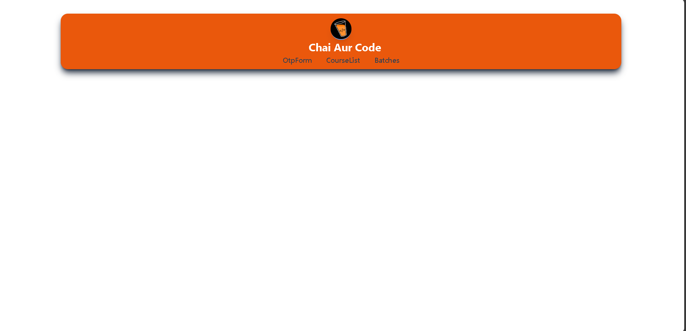
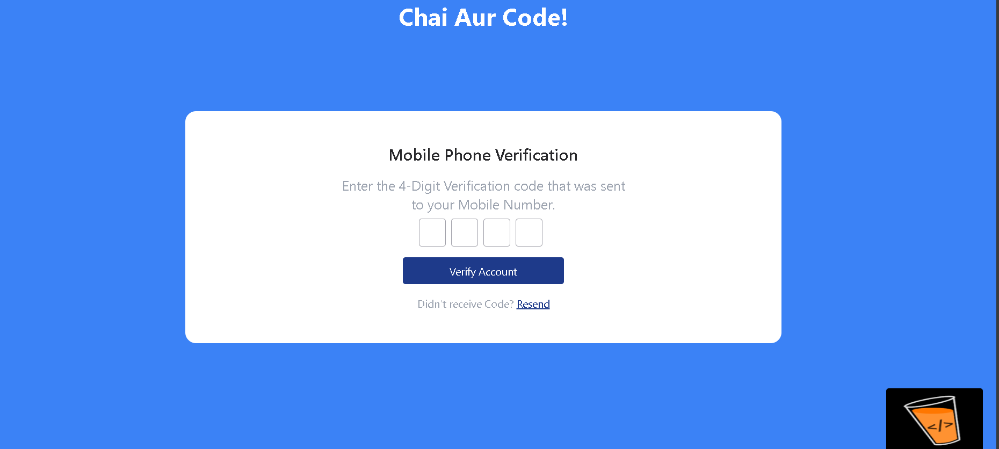
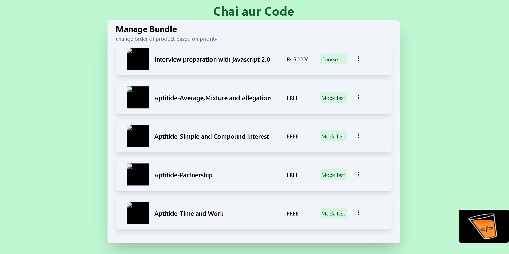

# MasterJi Project

This project fulfills all the requirements by implementing three pages: OTP Form, Course List, and Batches. Upon visiting the home page, you can navigate to each feature through the provided options.

## Home Page

When you visit the base URL `/`, you will be redirected to the `/otp-form` page. The home page provides options to navigate to the OTP Form, Course List, and Batches pages.



## OTP Form

The OTP Form page allows you to input a 4-digit OTP. It has four states:

- **Empty Form State:** Initial state with no input.
- **Filling State:** State during the input of the OTP.
- **Filled State (Success):** When the OTP is correctly filled.
- **Filled State (Error):** When the OTP is incorrectly filled.

)

## Course List

The Course List page features a vertical list of course cards that can be dragged and dropped. Each card contains a picture, title, price, type, and three vertical dots that provide options:

- **Move to Top:** Moves the card to the top of the list.
- **Move to Bottom:** Moves the card to the bottom of the list.
- **Remove:** Removes the card from the list.

The information on the cards is arranged horizontally.

)

## Batches

The Batches page includes a paginated table listing batches of a course and their statuses. It also features a search option to filter the batches.(not completed yet.)


## Branding Logo

A branding logo is positioned in the bottom right corner on all pages. Clicking this logo opens the [chaicode.com](https://chaicode.com) website.

## Installation

To set up the project locally, follow these steps:

1. Clone the repository:
   ```bash
   git clone https://github.com/Saksheekolekar/Masterji_Tasks

    Navigate to the project directory:

    bash

cd masterji-project

Install the dependencies:

bash

npm install

Start the development server:

bash

npm start

Open your browser and visit http://localhost:3000 to view the application.